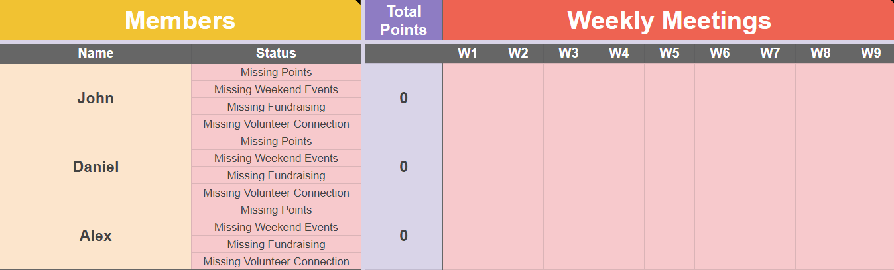

# RCC_GoogleSheetsParser
Developing a program in Python utilizing gspread API to streamline/automate tasks for Secretary of American Red Cross Club at UCI

# How the Application Works
1. UI launches when the program is run, prompting the user to enter in details such as the spreadsheet's name, which column to modify, and names of members that attended the meeting
2. The member names that the user enters into the textbox gets written to a text file called "input.txt"
3. Once the text file has been created and the other fields have been filled, the user is able to submit the changes to their Google Spreadsheet
4. The program parses the information and finds the correct cells on the spreadsheet and fills it with the user's defined value

# Requirements
1. Authenticating API on https://developers.google.com/
2. secret_client.json file
3. gspread, oauth2client, and ttkthemes libraries

# Guide to Give Program Read/Write Access to Google Spreadsheet(s)
https://www.twilio.com/blog/2017/02/an-easy-way-to-read-and-write-to-a-google-spreadsheet-in-python.html

# Installing the Libraries Required
```
pip install gspread
pip install oauth2client
pip install ttkthemes
```

# Command to Create an Executable File
```
pip install pyinstaller
pyinstaller.exe --icon=media/rcc_logo.ico -w --clean --onefile main.py config.py fileIO.py tkinterWidgets.py client_secret.json
```

## Progress

The following **additional** features are in-progress:

N/A

The following bugs/planned implementation have been addressed:
* [ x ] **FIXED** Try and catch needs to be implemented, and loop needs to continue going if name is not found
* [ x ] Try and catch does not exist for opening file
* [ x ] Name has to be exact spelling
* [ x ] Name has to have exact same format (ex. Name cannot be all lowercase or uppercase)
* [ x ] Create a friendly GUI (Tkinter) and/or a BATCH File
* [ x ] Create an output file for redirecting errors
* [ x ] Clear textbox when submitting names for input.txt
* [ x ] onUpdate for textbox
* [ x ] Use Column Letter instead of Column #
* [ x ] Change Text on Tkinter on successful submit
* [ x ] Provide an error message if the text file is empty

## Video Walkthrough

Here is a sample of the current prototype of the application



