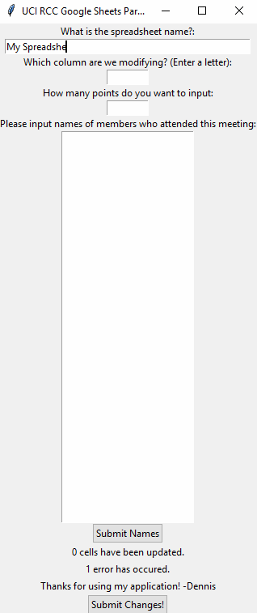

# RCC_GoogleSheetsParser
Developing a program in Python with gspread API to streamline/automate tasks for Secretary of American Red Cross Club at UCI

## User Stories

The following **core** functionality is completed:

* [x] 
* [x] 
* [x] 

The following **additional** features are in-progress:

* [] Provide an error message if the text file is empty
* [] Change Text on Tkinter on successful submit
* [] Use Column Letter instead of Column #

The following bugs/planned implementation have been addressed:
* [x] 1) **FIXED** Try and catch needs to be implemented, and loop needs to continue going if name is not found
* [x] 2) Try and catch does not exist for opening file
* [x] 3) Name has to be exact spellin
* [x] 4) Name has to have exact same format (ex. Name cannot be all lowercase or uppercase)
* [x] 5) Create a friendly GUI (Tkinter) and/or a BATCH File
* [x] 6) Create an output file for redirecting errors
* [x] 7) Clear textbox when submitting names for input.txt
* [x] 8) onUpdate for textbox

## Video Walkthrough

Here is a sample of the current prototype of the application

## Notes

Describe any challenges encountered while building the app.